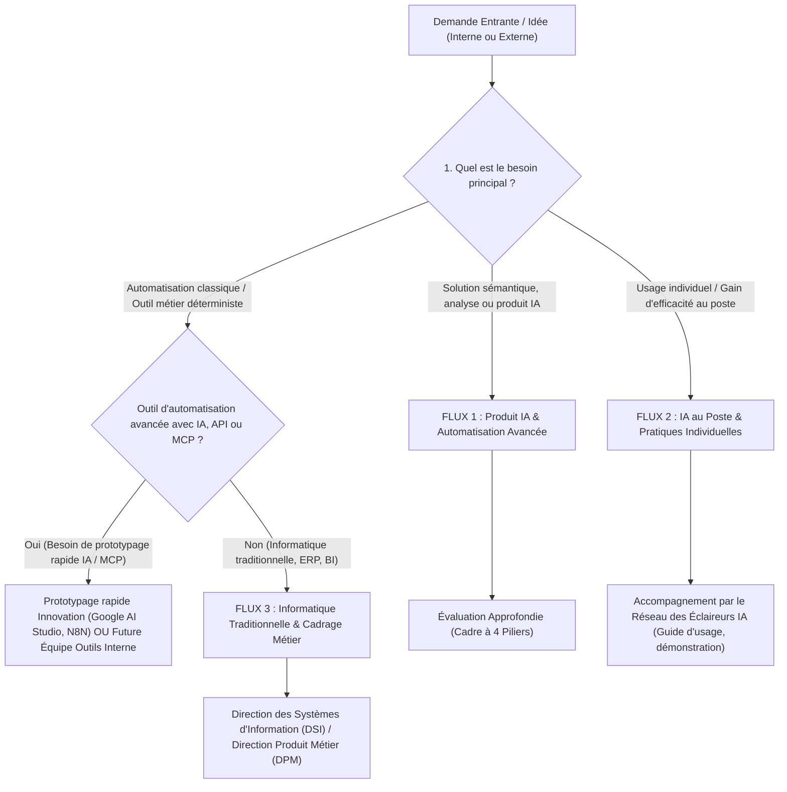

# Cadre d'Évaluation des Opportunités & Filtre IA
**Direction Innovation & Technologie — Legallais**
*Auteur : Responsable Produit Innovation & IA (Dorian Erkens)*

---

## 1. Vision & Principes du Filtre IA

Dans une ETI axée sur le commerce et la distribution B2B de quincaillerie comme Legallais, l'enthousiasme autour de l'intelligence artificielle générative crée une attente forte : l'IA est parfois perçue comme une solution miracle capable de résoudre immédiatement des difficultés organisationnelles ou des dettes informatiques historiques.

Le rôle du Responsable Produit (PM) Innovation & IA est d'agir comme un **filtre stratégique** (un protecteur et un orienteur) pour :
- **Protéger la trajectoire et les équipes** contre la dispersion et l'épuisement sur des projets non viables ou mal cadrés.
- **Orienter efficacement les demandes** en distinguant les vrais cas d'usage à forte valeur IA des simples automatisations traditionnelles ou des besoins de structuration métier.
- **Valider la portée interne et externe** : le cadre s'applique aussi bien aux outils destinés aux collaborateurs internes (ventes, contrats, logistique) qu'aux services proposés aux clients externes (artisans, grands comptes, fournisseurs).
- **Positionner la méthode d'exécution** : articuler le prototypage rapide (via des outils d'IA ou des plateformes de création assistée) avec les développements futurs ou la future équipe d'Outillage Interne.
- **Démontrer la valeur et l'impact business** (gain de temps, rentabilité, avantage concurrentiel).

> [!IMPORTANT]
> **Les 3 Principes Directeurs Legallais**
> 1. **L'IA ASSISTE** : L'IA n'automatise pas des décisions critiques sans supervision ; elle assiste et augmente les capacités des collaborateurs et des clients.
> 2. **RESPONSABILITÉ HUMAINE** : L'expertise métier, la validation finale et la responsabilité restent 100 % humaines.
> 3. **PAS D'IA SANS DONNÉES** : Pas d'IA performante sans données structurées, fiables, accessibles et qualifiées au préalable.

---

## 2. Le Tri Initial : Orientation en 3 Flux

Avant d'engager une évaluation approfondie, le Responsable Produit applique un filtre de qualification rapide pour diriger l'idée vers le bon canal d'exécution :



### Présentation des 3 Flux d'Orientation :

1. **FLUX 1 : Produit IA & Automatisation Avancée (Trajectoire Innovation)**
   - **Définition** : Service ou fonctionnalité structurante apportant une valeur forte, nécessitant de l'apprentissage automatique, du traitement du langage (LLM), de la sémantique ou des orchestrations d'automatisation avancée (connecteurs API, protocoles de contexte MCP, agents).
   - **Action** : Passation obligatoire de l'**Évaluation Approfondie (4 Piliers)**.

2. **FLUX 2 : IA au Poste & Pratiques Individuelles (Réseau des Éclaireurs IA)**
   - **Définition** : Usage individuel ou micro-accélérateur de productivité au quotidien (rédaction, synthèse, recherche documentaire, bureautique).
   - **Action** : Prise en charge par le réseau des **Éclaireurs IA** (fiches d'usages réplicables, démonstrations, montée en compétences). Pas de développement sur-mesure par l'équipe produit.

3. **FLUX 3 : Automatisation Traditionnelle & Outillage Interne**
   - **Définition** : Besoins informatiques déterministes (règles de calcul fixes, transferts de fichiers, tableaux de bord) ou besoins d'outils internes spécifiques sans brique d'IA nécessaire.
   - **Action** : 
     - Si l'idée nécessite une création d'application interne rapide : réalisation d'une première version par l'Innovation à l'aide d'outils de création assistés par l'IA (ex: Google AI Studio, plateformes No-Code), ou orientation vers la future **Équipe Outils Interne** (*Internal Tooling*).
     - Si l'idée relève du système d'information central : orientation vers la DSI (ERP Nodhos, Entp. Data) ou demande de cadrage métier préalable.

---

## 3. Le Cadre d'Évaluation à 4 Piliers

Ce référentiel structuré permet d'analyser chaque opportunité du **Flux 1** avant tout arbitrage d'investissement.

```
                           +-----------------------------------+
                           |    Référentiel d'Évaluation des   |
                           |          Opportunités IA          |
                           +-----------------------------------+
                                            |
        +-------------------+---------------+-------------------+-------------------+
        |                   |                                   |                   |
        v                   v                                   v                   v
+---------------+   +---------------+                   +---------------+   +---------------+
| 1. Alignement |   |  2. Demande,  |                   | 3. Faisabilité|   | 4. Impact     |
|  Stratégique  |   |   Marché &    |                   |  Technique &  |   | Financier &   |
|               |   |   Concurrence |                   |   Données     |   | Gain de Temps |
+---------------+   +---------------+                   +---------------+   +---------------+
```

---

### PILIER 1 : Alignement Stratégique & Portefeuille Produit

*L'opportunité s'inscrit-elle dans les orientations prioritaires de Legallais ?*

- **Adéquation avec la Stratégie IA Legallais** :
  - **Hermès** (Optimisation des flux : traitements des devis, commandes, réceptions fournisseurs).
  - **Atlas** (Intelligence Produit : bordereaux de prix unitaires, alternatives produits, indicateurs RSE / carbone).
  - **Orion** (Accélération commerciale : ventes complémentaires, relances de devis, détection d'opportunités).
- **Réutilisation de composants** : L'opportunité réutilise-t-elle les bases existantes de notre architecture (base vectorielle, connecteurs, modèles déjà intégrés) ou exige-t-elle un développement entièrement nouveau ?
- **Portée de la solution** : L'outil s'adresse-t-il à des usagers **internes** (commerciaux, gestionnaires) ou à des usagers **externes** (clients grands comptes, artisans, fournisseurs) ?

---

### PILIER 2 : Demande, Marché & Concurrence

*Le besoin est-il confirmé sur le terrain et pertinent face au marché ?*

- **Analyse du Besoin & Utilisateurs Cibles** : Quels sont les usagers concernés (collaborateurs internes ou clients/partenaires externes) ? Quel est le volume d'utilisation attendu ?
- **Analyse de Marché & Concurrence** :
  - *Que font les autres acteurs de la distribution B2B et du secteur de la quincaillerie sur ce sujet ?*
  - *S'agit-il d'un élément d'alignement sur les standards du marché ou d'un véritable avantage concurrentiel différenciant ?*
- **Maturité du Processus & Règle Métier** : Le processus actuel est-il formalisé, clair et conforme sur le plan réglementaire/juridique ? *(On ne digitalise pas un processus instable ou non conforme).*
- **Disponibilité des Référents Métier** : Les experts métiers peuvent-ils consacrer du temps à la phase de cadrage et de validation ?

---

### PILIER 3 : Faisabilité Technique & Données

*Avons-nous les éléments techniques et les données nécessaires pour réussir ?*

- **Analyse de la Pertinence Technique (Besoin réels d'IA ou d'API/MCP)** :
  - Le problème exige-t-il du traitement du langage, de la sémantique, de l'apprentissage ou des orchestrations complexes via API/MCP ?
  - *Ou peut-il être résolu par des règles informatiques déterministes classiques ?*
- **Disponibilité & Qualité des Données** : Les données d'entrée sont-elles stables, accessibles, historisées et qualifiées ?
- **Stratégie de Réalisation (Faire en Interne vs Acheter sur Étagère)** :
  - **Acheter sur étagère** : Solution existante sur le marché, intégrable et testable rapidement.
  - **Faire en interne** : Développement spécifique lié au cœur de métier Legallais exigeant une maîtrise totale.
  - **Prototypage rapide** : Utilisation d'outils de création assistés par l'IA ou transfert vers l'équipe d'Outillage Interne.

---

### PILIER 4 : Impact Financier & Gain de Temps

*Quel est le bilan entre la valeur créée et l'effort nécessaire ?*

- **Évaluation du Gain de Valeur** :
  - Temps économisé et productivité gagnée (ex: équivalent temps plein libéré).
  - Chiffre d'affaires additionnel, préservation de la marge ou réduction des erreurs.
  - Amélioration de la satisfaction des clients ou des collaborateurs.
- **Bilan Effort & Temps Investi** :
  - Temps manuel consommé aujourd'hui vs Effort de développement et de maintenance.
  - Coûts d'infrastructure et d'utilisation des services d'IA.
- **Capacité de Traitement** : Capacité de l'équipe à traiter le sujet par rapport au portefeuille de projets prioritaires de l'année.

---

## 4. Matrice d'Arbitrage & Orientations

À la suite de l'évaluation, la demande reçoit l'une des orientations officielles suivantes :

| Statut Retenu | Critères de Choix | Trajectoire & Action |
| :--- | :--- | :--- |
| **`Accepté - Innovation (Preuve de Valeur)`** | Besoin d'IA ou d'automatisation avancée validé, valeur forte, données prêtes. | Inscription au programme de prototypage de la Direction Innovation. |
| **`Accepté - Prototypage Rapide / Outils Internes`** | Besoin d'application interne rapide sans IA lourde. | Prototypage rapide via outils guidés par l'IA ou passage à l'Équipe Outils Interne. |
| **`Accepté - Éclaireurs IA`** | Usage individuel au poste, gain de productivité personnel. | Prise en charge par le réseau des Éclaireurs IA (accompagnement, guide). |
| **`Réorienté - DSI / DPM`** | Problème informatique traditionnel (ERP, BI, flux de données). Pas besoin d'IA. | Transmission à la DSI ou à la Direction Produit Métier. |
| **`Ajourné - Cadrage Métier Requis`** | Processus mal défini, données manquantes ou instables. | Renvoi au métier pour structuration et clarification préalable. |
| **`En Attente de Priorisation`** | Opportunité pertinente et validée, mais capacité annuelle de l'équipe atteinte. | Inscription sur la liste de réserve pour examen ultérieur. |

---

## 5. Fiche de Synthèse d'Évaluation (Modèle Réutilisable)

*Modèle au format texte à compléter par le Responsable Produit pour formaliser chaque évaluation.*

```markdown
# Fiche d'Évaluation d'Opportunité — [Nom du Projet]

**Date** : [JJ/MM/AAAA]  
**Auteur** : Dorian Erkens (Responsable Produit Innovation & IA)  
**Demandeur & Métier** : [Nom, Rôle & Direction]  
**Usagers Cibles** : [Internes (commerciaux, gestionnaires...) / Externes (clients, partenaires...)]  
**Orientation Proposée** : [`Accepté - Preuve de Valeur` | `Accepté - Outils Internes` | `Accepté - Éclaireurs IA` | `Réorienté DSI` | `Ajourné Métier` | `En Attente`]

---

### 1. Synthèse du Besoin & Contexte
- **Description du besoin** : [Synthèse en quelques phrases]
- **Contexte & Temporalité** : [Pourquoi cette demande aujourd'hui ? Quelle est l'urgence ?]
- **Problème métier à résoudre** : [Difficulté constatée, perte de temps, impact financier...]

---

### 2. Synthèse des 4 Piliers

#### A. Alignement Stratégique
- **Périmètre** : [Hermès / Atlas / Orion / Hors Périmètre]
- **Composants réutilisables** : [Oui / Non]

#### B. Demande, Marché & Concurrence
- **Concurrence & Marché** : [Pratiques constatées chez les concurrents, avantage compétitif vs standard marché]
- **Maturité du processus** : [Clair et formalisé / À structurer]

#### C. Faisabilité Technique & Données
- **Technologie requise** : [IA, Traitement du langage, API / MCP, Automatisme classique]
- **Données d'entrée** : [Accessibles et fiables / Instables / Manquantes]
- **Méthode de réalisation** : [Création sur-mesure / Achat sur étagère / Prototypage rapide AI Studio / Équipe Outils Internes]

#### D. Impact Financier & Gain de Temps
- **Valeur estimée** : [Temps gagné, gains financiers, amélioration du service]
- **Niveau d'effort** : [Faible / Moyen / Élevé]

---

### 3. Recommandation & Prochaines Étapes
- **Analyse du Responsable Produit** : [Explication motivée de la décision]
- **Actions prioritaires** :
  1. [Action 1]
  2. [Action 2]
```

---

## 6. Guide d'Entretien (Questions Clés de Cadrage)

Pendant l'entretien de découverte avec le demandeur, le Responsable Produit utilise ces questions pour conduire l'échange :

### 🎙️ Questions Clés de Cadrage :

1. *"Pourquoi demander de travailler sur cette idée aujourd'hui ? Quels sont le contexte et la temporalité ?"*
2. *"Si nous mettons en place plus de digital et d'IA, sur quoi voulez-vous malgré tout garder la main dans cette opportunité ?"*
3. *"Si l'IA n'existait pas, comment résoudriez-vous ce problème aujourd'hui ?"*
4. *"Que font nos concurrents ou les autres acteurs du marché sur ce sujet ? S'agit-il de nous mettre au niveau ou de prendre de l'avance ?"*
5. *"Cette solution s'adresse-t-elle à nos équipes en interne ou directement à nos clients / partenaires externes ?"*
6. *"Avez-vous un schéma ou une description claire des étapes actuelles du processus (qui fait quoi, avec quelles règles) ?"*
7. *"D'où viennent les données utilisées ? Sont-elles toujours disponibles au même format et hébergées au même endroit ?"*
8. *"Quel est le temps passé ou le coût lié à la situation actuelle ?"*
9. *"Êtes-vous prêts à mobiliser un référent métier quelques heures par semaine pour tester et valider le prototype avec nous ?"*
